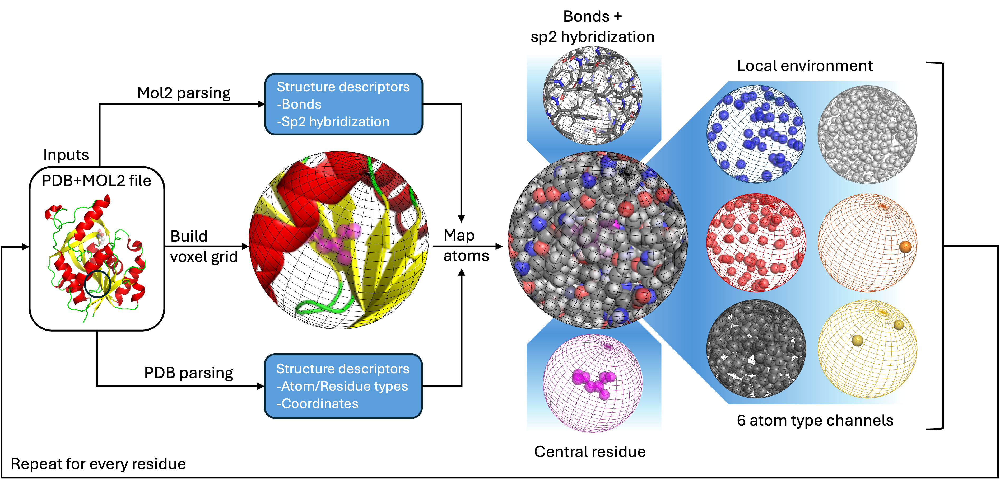

# Introduction
Spheronizator is a Python research utility designed to voxelize protein structural data from existing PDB and mol2 files for use in machine learning training sets. The utility is intended to be a part of your data processing pipeline, with an interface that is convenient to use with IPython, Jupyter, or similar.

More specifically, spheronizator implements a methodology for extracting features from the spatial environments surrounding each residue.

The utility is designed such that the number, type, and content of each extracted feature can be easily adapted for a researcher's needs. The idea is that a researcher uses this utility as a backbone for the computation and organization of the spatial significance of each feature.

## Basic Description of Methodology
Spheronizator implements its methodology by representing the region around each residue with a rectangular voxel grid. Atoms within the region of space centered on the residue are mapped to this voxel grid, and features from each atom are used to update data associated with each voxel. An output array of the voxels for each residue in the protein is generated.

## What it does
- Implements a methodology for processing protein data.

More specifically, spheronizator implements the `voxelBuilder` class which contains functions which:
- Parse protein structural data from provided PDB files and updates the structural data with additional information contained in corresponding mol2 files.
- Process parsed protein data into configurable Numpy output arrays on a per voxel basis to generate a subset of data representative of the local environment around each residue.

## What it does not do
- Automate the processing of protein data
- Save output arrays
- Train a model
- Implement a model