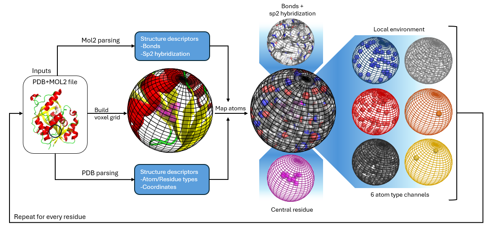

# Summary
Spheronizator introduces a configurable and extensible computational pipeline for the generation of rich, structured representations of proteins using a spherical voxelization scheme. Spheronizator implements its methodology by representing the region around each protein residue with a rectangular voxel grid, and features in this region are used to update data associated with each voxel. This voxelization scheme enables detailed spatial and chemical characterization of protein residues. Spheronizator produces outputs that are readily compatible with machine learning frameworks and can be used as input for tasks such as binding site classification or protein-ligand interaction prediction.

# Statement of need
@torng describe a general framework and methodology to represent protein structural information for use in 3D Convolutional Neural Networks (3DCNN). Torng and Altman were able to demonstrate a provisional implementation of their methodology achieved 85% accuracy predicting outcomes of T4 lysozyme mutation variants. Although Torng and Altman's framework was able to show future viability of 3DCNN frameworks in more advanced protein modeling, the implementation is not available as a standalone tool, and their research only investigates samples taken from within cubic regions at a fixed resolution.

Spheronizator is an open-source, extensible implementation of Torng and Altman's general framework that leverages existing open-source tools and libraries popular in the field. Spheronizator addresses the key limitations of Torng and Altman's general framework by introducing configurable resolutions and support for a spherical voxelization scheme. Spheronizator's implementation affords integrability with other projects, tools, and technologies, serving as a backbone for researchers wishing to incorporate arbitrary features into a comprehensive model.

Spheronizator presently aims to incorporate features adapted from two open-source tools to produce a model for predicting protein-protein interactions.

- **InteracTor:** this utility quantifies features such as hydrogen bonds, van der Waals forces, and hydrophobic contacts [@silva].
- **GLM Score:** is a utility which quantifies the effects of features such as deformation effects, repulsive interactions, and solvent accessible surface area to predict protein-protein binding affinities [@dias].

# Functionality

## Parsing of Protein Data ##
The project implements a hybrid mol2 and PDB parser extending upon [Biopython's](https://biopython.org/) PDB parsing capabilities to incorporate additional atom and bond information. The package reads and parses PDB files and constructs a hierarchical structure of chains, residues, and atoms, while distinguishing between standard amino acid residues and other molecular entities, such as ligands or solvent molecules, tagging each atom accordingly. The parser then reads and parses the corresponding mol2 file to update the information associated with each atom to include:

- A detailed chemical type.
- A simplified atom type (e.g., carbon, oxygen).
- A list of an atom's bonded neighbors.
- The types of bonds joining an atom to its neighbors (e.g., single, double, aromatic).

## Coordinate Transformation ##
The utility constructs a coordinate transformation using the alpha carbon, nitrogen, and carboxylic acid as the basis vectors. These basis vectors are used to construct a projection matrix which is then applied to all the constituent atoms in the structure. This alignment is crucial for comparative analyses and for machine learning applications that require rotational invariance.

## Voxelization ##
The core of the project is the voxelization of protein data into a user-configurable rectangular array, with options for size, resolution, and data type. The utility maps atoms from the projected coordinate array to their corresponding voxels based on their either a set radial diameter from the center of the residue, or their ability to be enclosed by a cube of a set vertex length centered on the residue. The utility supports collision detection, warning users if multiple atoms are mapped to the same voxel and providing functions for debugging collisions.

## Feature Extraction ##
Each voxel is assigned a multi-channel feature tensor with support for the following features:

- The presence of atoms of specific types, including hydrogen, carbon, nitrogen, oxygen, phosphorus, and sulfur.
- Whether or not an atom belongs to the central residue or the parent structure only.
- Bond counts associated with the residue.

The utility is designed such that the number, type, and content of extracted features are easily extensible by the user.

## Outputs ##
The utility presently produces the two following data structures as outputs:

- A [NumPy](https://numpy.org/) array with dimensions corresponding to the number of residues in the processed protein, the three-dimensions of the rectangular voxel grid, the types of atoms in the voxel grid, the presence of an atom at this location, and whether or not the atom belongs to the central residue.
- A NumPy array containing the counts of each type of bond present in the region surrounding the central residue.

# Acknowledgements #
